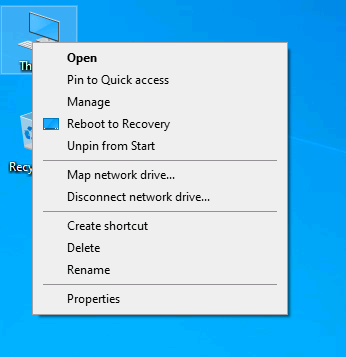
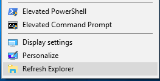

If adding additional user content, place any setup files, scripts or content to be added to the image here.

Any setup content, including answer files, scripts and executables, should ALWAYS be removed immediately after they are run by the installing Administrator unless they are designed for specific tasks when a new user account is created or logs in. Not doing so can allow other users with access to the system to run this content or extract potential sensitive data. This can be automated by adding their automatic removal to the SetupComplete.cmd that is supplied by default.

 
